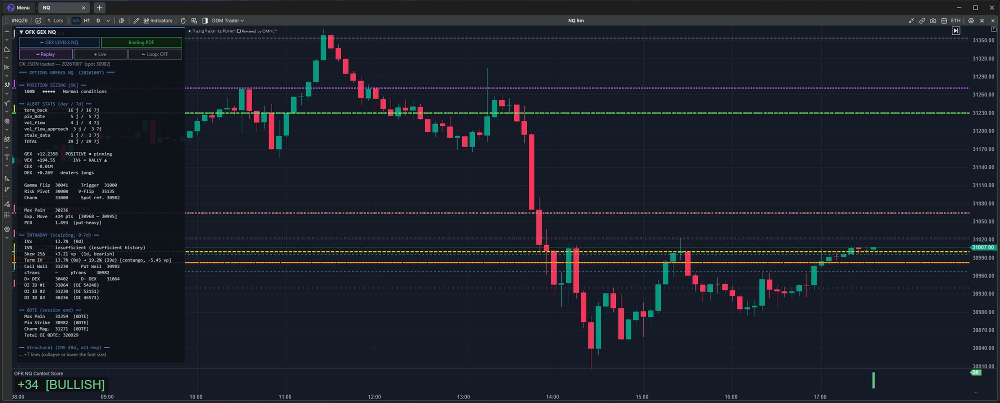
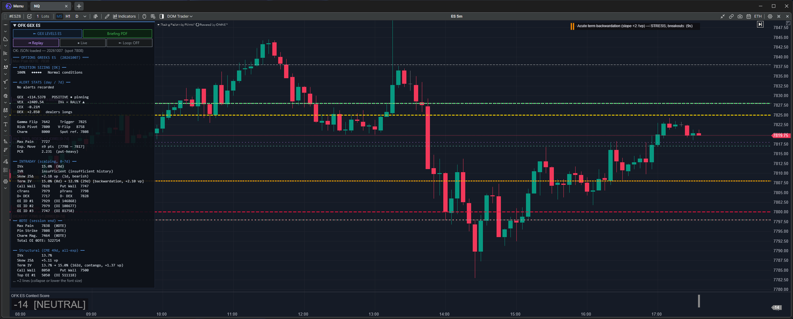
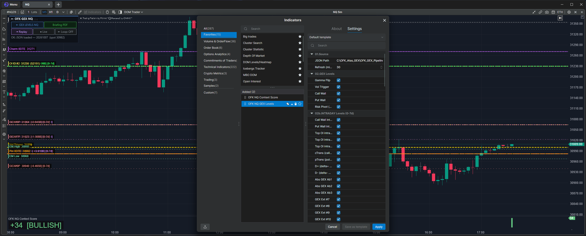
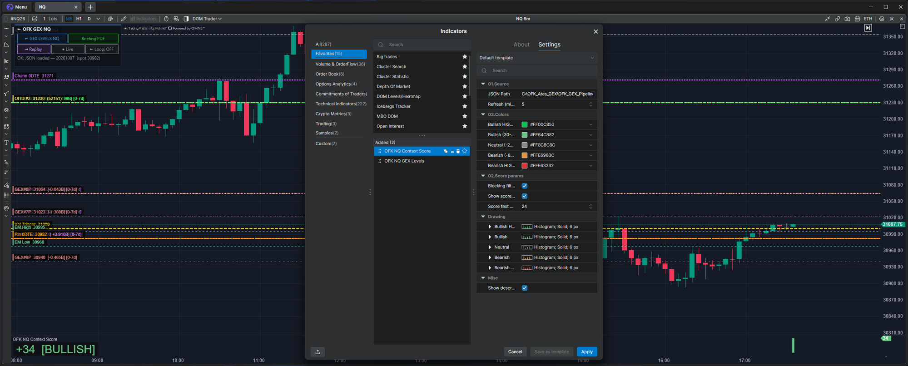
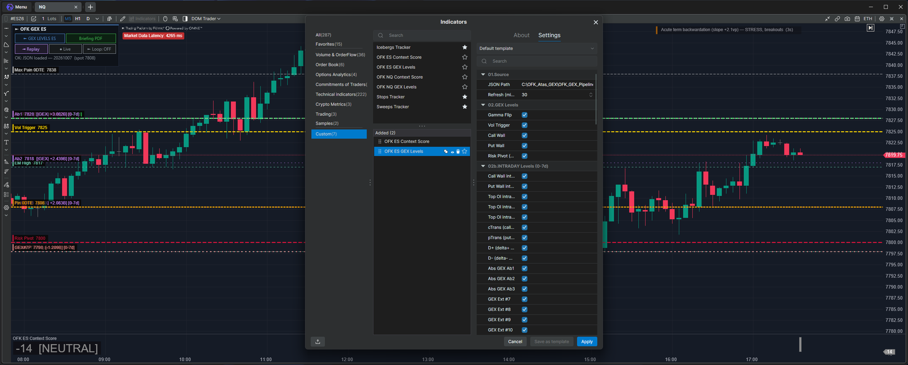
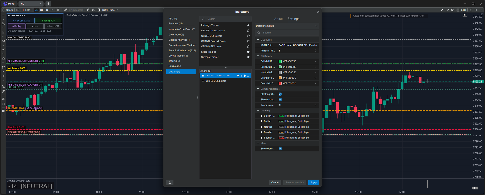

# OFK_Atas_GEX

ATAS indicators and Python pipeline for trading the E-mini Nasdaq-100 (NQ) and E-mini S&P 500 (ES) futures using options-derived levels (GEX, DEX, walls, gamma flip, pin strikes) and AI-generated daily briefings.

> **About this fork** — branch `atas-x` of [Kza56/OFK_Atas_GEX](https://github.com/Kza56/OFK_Atas_GEX):
> - runs on **ATAS X** (no WPF: on-chart panel, clickable buttons, replay buttons);
> - **portable**: any install folder (`OFK_GEX_HOME`), any machine timezone (exchange clock);
> - Gamma/Vanna Flip computed from the exposure profile (never the spot as fallback) and
>   side-aware intraday walls (Call Wall above / Put Wall below spot);
> - pipeline runs without a console window; CME browser kept off-screen without stealing focus.
>
> Same license as upstream (PolyForm Noncommercial 1.0.0).

## What it does

- **Python pipeline** scrapes CME and CBOE option chains, computes Greeks Exposure levels (GEX, VEX, DEX, CEX), enriches with VIX and macro context, and writes a JSON file every 5 minutes during RTH.
- **ATAS indicators (C#)** read the JSON and draw the levels live on NQ/ES charts, with an on-chart context score, an on-chart panel with buttons, an intraday replay, and 12 alert types.
- **AI briefing** uses Claude to generate a daily JSON briefing with regime analysis, RTH plan (buy/sell zones, invalidations), and risk alerts. Rendered as a dark-theme A4 PDF.

## Quick install

**Install path**: any folder. The indicators' default paths come from the environment
variable `OFK_GEX_HOME` (the repository folder); without it they default to `C:\OFK_Atas_GEX\`
(`~/OFK_Atas_GEX` outside Windows). Set it once, then restart ATAS:

```powershell
[Environment]::SetEnvironmentVariable('OFK_GEX_HOME', 'D:\Trading\OFK_Atas_GEX', 'User')
```

The Python pipeline and `OFK_Loader.cmd` resolve their paths relative to their own folder,
and the Claude CLI is found on `PATH` (`CLAUDE_CMD` only overrides it).

**Timezone**: any. Session dates, DTE, holidays, the last-hour / 0DTE windows and the
intraday replay follow the exchange clock (America/New_York, DST-aware), not the
machine's local time. Snapshot files are named in UTC.

**ATAS X**: `dist/OFK_Atas_GEX.dll` is built for ATAS X from this branch (ATAS X rejects WPF
indicators, so upstream's DLL does not load there). Copy it to `%APPDATA%\ATAS X\Indicators\` —
ATAS X hot-reloads it. To rebuild: `dotnet build -c Release` in `OFK_ATAS` (.NET 10 SDK).

### Steps

1. Get this branch: `git clone -b atas-x https://github.com/Pinha/OFK_Atas_GEX` (or download the `atas-x` ZIP)
2. Put the `OFK_Atas_GEX` folder anywhere (e.g. `C:\OFK_Atas_GEX\`)
3. If it is not `C:\OFK_Atas_GEX\`, set `OFK_GEX_HOME` (see above)
4. **Install Python 3.10 or higher** (tested on 3.14) if you don't have it already: download from [python.org](https://www.python.org/downloads/windows/) and **make sure to check "Add Python to PATH"** during installation. Verify it works by opening PowerShell and running `python --version` — you should see `Python 3.10` or higher (try `python3 --version` if `python` is not recognized).
5. Open PowerShell and run:

```powershell
# Copy the precompiled DLL to ATAS X (from the repository folder)
Copy-Item ".\dist\OFK_Atas_GEX.dll" "$env:APPDATA\ATAS X\Indicators\" -Force

# Install Python dependencies (from the repository folder)
cd .\OFK_GEX_Pipeline
pip install -r requirements.txt
playwright install chromium
```

6. Indicators appear in the "OFK Suite" category:
   - OFK NQ GEX Levels
   - OFK NQ Context Score
   - OFK ES GEX Levels
   - OFK ES Context Score

The precompiled DLL targets ATAS X (.NET 10 / Windows). No build tools required.
`OFK_Loader.cmd` runs the tests and both morning pipelines from any folder (desktop shortcut friendly).

> **Building from source** (only if you modify the C# code): see [OFK_ATAS/README.md](OFK_ATAS/README.md).

## Daily usage

The package ships **two indicators that work together**: `OFK GEX Levels` (the levels and the on-chart panel) and `OFK Context Score` (a directional bias gauge, in a sub-pane). Both read the same `full_levels_*.json` produced by the Python pipeline.

<p align="center">
  
  <br><sub>NQ 5m on ATAS X — panel (top-left), GEX levels on the chart, Context Score sub-pane (bottom)</sub>
</p>

### 1. GEX Levels — the panel and the buttons

Once `OFK NQ GEX Levels` (or its ES counterpart) is added to your chart, a panel drawn on the chart summarizes everything you need for the session — and its buttons run the entire workflow without touching a terminal. Click the panel title to collapse/expand it; if the text does not fit the price pane it ends with `… +N lines`. Position, font size and opacity are in the indicator settings (group `09`). While the panel is shown, ATAS' own indicator list and status line move to its right.

<p align="center">
  
  <br><sub>Same on ES 5m</sub>
</p>

#### Reading the panel

Below the buttons and the status line, the panel shows a structured snapshot of the current session:

- **Header banner** — `OPTIONS GREEKS NQ` confirms the symbol and shows the trade date of the underlying option chain.
- **Position sizing** — Suggests a risk allocation level (`100% • • • • •` for normal, scaled down to `20%` in stressed regimes) based on VIX, blackout, and data freshness.
- **Alert stats** — Counts of triggered alerts today (current New York session) and over the last 7 days.
- **GEX / VEX / CEX / DEX block** — Aggregate dealer positioning. The label (`POSITIVE • pinning`, `NEGATIVE • amplifying`, etc.) is the regime headline.
- **Key structural levels** — Gamma Flip, Vol Trigger, Risk Pivot, Vanna Flip, Charm Magnet, Max Pain, Expected Move range, and PCR. A flip of `0` means no zero crossing within ±15% of spot (undefined).
- **Intraday section (0-7 DTE)** — IVx/IVR/Skew/Term, Call Wall (at/above spot), Put Wall (at/below spot), cTrans/pTrans, D+/D- DEX, top OI strikes — the levels that matter most for scalping.
- **0DTE section** — End-of-session magnets (Max Pain, Pin Strike, Charm) plus total 0DTE OI.
- **Structural section** — CME 49d levels for the broader context.

#### The buttons (no command line needed)

| Button | What it does |
|---|---|
| **► GEX LEVELS NQ** | Runs the full morning pipeline (CME scrape + CBOE fetch + VIX/macro merge + AI briefing + PDF) in the background — no console window, no focus stealing; output in `data/logs/run_morning_NQ_last.log`. Use it once at the open, or any time you want to force-refresh. |
| **Briefing PDF** | Opens the latest daily briefing PDF (regime analysis, RTH plan with buy/sell zones, risk alerts, one-line summary) generated by the AI agent. |
| **◄ Replay / Replay ►** | Steps through today's intraday snapshots (one every 5 minutes while the loop runs) — the chart shows the levels as they were; past the last snapshot returns to live. |
| **● Live** | Shown when not in replay. |
| **► Loop: OFF / ■ Loop: ON** | Toggles the 5-minute intraday refresh (CBOE 0-7 DTE data). The chart picks up each new JSON within 5 seconds. Structural CME levels change only with **GEX LEVELS**. |

<details>
<summary><b>Indicator settings (screenshots)</b></summary>

<p align="center">
  
  
  
  
</p>
</details>

### 2. Context Score — the directional bias gauge

`OFK NQ Context Score` (or its ES counterpart) renders in a sub-pane below the chart. It collapses the entire dealer positioning picture into a single number between **−100 and +100** and explains *why* it landed there.


#### How to read it

The score has five buckets, each with its own color shown as a histogram bar in the sub-pane:

| Score range | Bucket | Color | Meaning |
|---|---|---|---|
| **≥ +70** | BULLISH HIGH | 🟩 bright green | Strong dealer positioning toward upside — squeeze territory above intraday Call Wall |
| **+30 to +69** | BULLISH | 🟢 soft green | Net bullish context — favorable to long scalps |
| **−29 to +29** | NEUTRAL | ⬜ light gray | No directional edge — pin strikes dominate, range plays |
| **−30 to −69** | BEARISH | 🟧 orange | Net bearish context — favorable to short scalps |
| **≤ −70** | BEARISH HIGH | 🟥 bright red | Strong dealer positioning toward downside — squeeze territory below intraday Put Wall |

Below the score, the indicator lists the **reasons** that drove it (e.g. `CW broke • GF+ • squeeze+`), so you can see at a glance which factors are dominant right now.

#### What goes into the score

Each contribution is signed and capped, then summed and clamped to [−100, +100]:

- **Position vs Call/Put Walls** (up to ±30) — Where spot sits relative to the wall cluster. Above intraday CW = bullish; below intraday PW = bearish.
- **Distance to Gamma Flip** (up to ±30) — Normalized by the day's expected move. Far above GF = stronger bullish; far below = stronger bearish.
- **Gamma regime tag** (±20, ±5) — `squeeze+`, `pos-gamma`, `neg-gamma`, `squeeze-` based on spot's location in the gamma map.
- **D+/D− DEX magnets** (up to ±15) — Pull from delta-positive or delta-negative dealer hedging zones.
- **Skew 25Δ** (−10 if extreme, −5 if elevated) — Heavy put hedging is a bearish tilt.
- **Term structure backwardation** (−5) — Acute stress signal.
- **Macro proximity** (±5) — Small drift toward whatever the recent macro momentum favors.

#### Blocking filters

When enabled (default), the score is **forced to 0** under three conditions:
- VIX is in the EXTREME regime (panic or vol crush)
- A high-impact macro event is within the next 30 minutes (blackout window)
- The pipeline data is stale or missing

The score also displays a small text overlay on the chart showing the live value and tag (e.g. `+51 [BULLISH]`).

### Power-user shortcut (optional)

If you prefer to run the pipeline from the terminal — for cron jobs, headless setups, or scripting — the same scripts are directly callable:

```powershell
cd C:\OFK_Atas_GEX\OFK_GEX_Pipeline
python run_morning_NQ.py
python run_morning_ES.py
python run_intraday_refresh.py NQ --loop --interval 300
```

## Documentation

- **[OFK_ATAS/README.md](OFK_ATAS/README.md)** — ATAS indicators reference (and how to build from source)
- **[OFK_GEX_Pipeline/README.md](OFK_GEX_Pipeline/README.md)** — Python pipeline reference
- **[OFK_GEX_Pipeline/GUIDE_GEX_LEVELS.md](OFK_GEX_Pipeline/GUIDE_GEX_LEVELS.md)** — Trader's guide to reading the levels (the most important doc for traders)
- **[docs/integration_handoff/](docs/integration_handoff/)** — Integration contract for external consumers (7 documents)

## Requirements

- Windows 10 / 11
- ATAS 1.5+
- Python 3.10+
- Claude Code CLI (`npm i -g @anthropic-ai/claude-code`) for AI briefings

## License

PolyForm Noncommercial 1.0.0 — see [LICENSE](LICENSE).

This software is free for personal, educational, and non-commercial use. Commercial use requires prior written permission from the author. Contact via GitHub issues.
